# A logical Approach to type soundness 

- limitations of syntactic type safety 
  1. unsafe features in safe languages 
  2. enforcement of data abstraction cannot be described or proven 

- motivates semantic type soundness

## Intro
- Milners idea of type soundness:
  - $\lambda$- calculus based PL with polymorphism 
  - described using denotational semantics
  => didn't scale ...why?

- __Syntactic type soundness__ -> progress and preservation
- limitations of STS:
  - by "no enforcement of data abstractions" they mean that invariants like private access programmers (would like to) put on data abstraction cannot be enforced/checked by the purely syntactic approach (why?)
  - unsafe features seem to be necessary (for the same reason we need semantics andnot just syntax?)
  but syntax cannot reason about unsafe code
  - those two things combine in the use of safe abstractions of unsafe code e.g. in Rust, where the (runtime) behaviour of data abstractions (e.g. RefCell) can maintain type safety guarantees but cannot be syntactically checked cause they use unsafe features

- __Logical Type soundess__ 
  - Idea: define a semantic model of types i.e .a mapping of types to runtime interpretations (values)
  - syntactic typing -> intrinsic/structure of types
  - semantic typing  -> extrinsic/what values do they map to/how do they "behave"
  - the __Logic__ part comes from Separation Logic
  - build on operational semantics using step-indexed models 
  BUT
  - use a more high-level abtraction namely Separation logic
   (the idea is as far as I understood, to treat sigle steps only when necessary i.e. when an opertation has to be atomic, because it concerns shared state and even then the argument is "behaves atomic")
  - __Representational Independence__ is another idea introduces by the semantic approach i.e. 
    - instead of having a unary predicate, that tells if a program is correct (an expression is well typed)
      have a binary predicate, that tells if two programs behave the same way
  
## The Example Language -- MyLang

- call-by-value λ-calculus with impredicative polymorphism, iso-recursive types, higher-order state, and
fine-grained concurrency

- static expressions  $\widehat{e}\in \widehat{Expr}$ are transformed to dynamic (runtime) expressions  $e\in Expr$
  by a type __erasure__ function

- programs are written in static syntax, but operational semantics and and proof of type safety is based on runtime expressions
- __type erasure__ also adds __locations__ to the syntx i.e. there's no locations in static syntax (assuming the programmer is not allowed to directly access locations)
but dynamic syntax and operational semantics contain location values

- types are unit (1), bool (2) and integers (Z) as well as products, sumtypes and functions as well as 
recursive, polymorphic and existential types

- __existential types__: 
  - __pack__$\langle B, \widehat{e}\rangle: \exists \alpha . A$
  means, there is an abstract data type $\exists \alpha . A$
  actually $\alpha$ is not a type parameter, it is fixed as $B$ but the client using the expression, can only rely on features of type $A$ and cannot see the implementation type $B$
  - however client code can access $ \widehat{e}$ which is a term containing operations on type $A$ by
 __match__ $ \widehat{e_{packed}} $ with __pack__$\langle \alpha, \widehat{usefull\_term}\rangle \Rightarrow \widehat{e_2} $ 

- references can be allocate ( __ref__ $\widehat{e}$ ), read from ( $ ! \widehat{e}$ ) and written to  ( $ \widehat{e_0} \leftarrow \widehat{e_1}$ )  \widehat{e}
- __concurrency operations__ are fork, FAA and CAS
  - FAA and CAS are atomic
  - fork immediately returns ()

### Syntactic Typing $\boxed{\Gamma \vdash \widehat{e}}$

- simplified form because "fresh" binders are assumed for any expression or type variables

- rules are as expected and also defined for dynamic expression $e$ by ommitting the type varaibles in rules involving polymorphic or exitential types

### Operational Semantics

- are defined based on __values__, __states__ and __evaluation contexts__
- __states__ $\sigma$ are heaps

- small-step operational semantics:
  1. _base reduction relation_ $(\sigma, e) \rightarrow (\sigma', e')$
    - auxilliary _pure reductions_ handle steps without heap involvement
    - denotations for binary operations are partial to account for wrong usage (10 + true = ???)
  2. __evaluation context__'s lift base reductions to _thread local reductions_
  3. _thread pool reductions_ $(\sigma, \overrightarrow{e}) \rightarrow_{tp} (\sigma', \overrightarrow{e'})$ is a relation of machine states. $\overrightarrow{e}$ represents asequence of expressions executing in different threads 
   (Question: Does Sequnce mean there is an order? Is each expression in a separate thread?)
    a step in this relation either makes a thread local reduction, or a __fork__. 
    Reminder: Threads immediately return (): this means there is no other return value, threads communicate via the heap and endign a thread is a local operation that changes the shared heap. 
    ToDo: Check -> Is this also the way heaplang is modelled? Do futures work differently or can they be considered as writing to a pre-allocated heap spot? 

### (Syntactic) Type Soundness 

1. A machine state $(\sigma, \overrightarrow{e})$ is _progressive_
   iff _any_ thread in the pool is either a value or can make local progress 
  -> Question: What does it mean for a thread to be a value??

2. A closed expression representing a program is _safe_ $safe(e)$ if _any_ machine state reachable from by evaluating the expression is _progressive_
 -> Question: Shouldn't that be "_all_ machine states"?

Now type soundness is defined as
 $$(\empty \vdash e:A)\  \Rightarrow\  safe(e)$$

### Syntactic Type Soundness via Progress and Preservation

As the definition of _safe_ includes the heap (i.e. the machine state) the soundness definition reads as "each value in the heap and each expression in the pool is well-typed"

=> To formalize this we need to talk about heap locations
=> To include this in the definition of well-typedness there's a 
   __heap typing__ $\Sigma: Loc \rightarrow_{fin} Type$ that maps heap locations to closed types 
    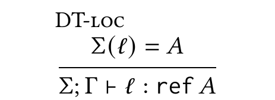
  
for other typing rules, the heap tpying context is just threaded though

So the __typing judgement for a machine state__ is 
  
  __$\boxed{\Sigma\vdash_{MS}(\sigma, \overrightarrow{e}): \overrightarrow{A}}$__ 

where $\overrightarrow{A}$ is a list of types corresponding to the list of threads $\overrightarrow{e}$

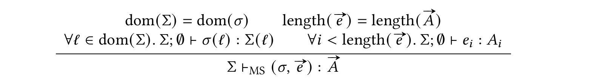

A machine state is well-typed iff
  1. the heap and it's typing context contain the same locations
  2. for all those locations, the value they map on the heap, has the type they map in heap typing context
  3. there are as many expressions as there are thread types
  4. all those expression have (judged by variable and heap context) their corresponding type in the type list $\overrightarrow{A}$

Now type Soundeness for Machine States means:

1. Progress : Well typed machines are progressive i.e. if $\Sigma\vdash_{MS}(\sigma, \overrightarrow{e}): \overrightarrow{A}$, then $progressive(\sigma, \overrightarrow{e})$
2. Preservation: Reduction/Evaluation preserves well-typedness and hence progressiveness, i.e. 
if $\Sigma\vdash_{MS}(\sigma, \overrightarrow{e}): \overrightarrow{A}$ and $(\sigma, \overrightarrow{e}) \rightarrow_{tp} (\sigma', \overrightarrow{e'})$ then 
there is a new heap typing context $\Sigma'\supseteq \Sigma$ and an extended lsit of thread types $\overrightarrow{A'} \supseteq \overrightarrow{A}$ such that $\Sigma'\vdash_{MS}(\sigma', \overrightarrow{e'}): \overrightarrow{A'}$

Note: heap typing and thread type list are extended, because there is no cleanup i.e. data remained on the heap, threads remain on the list even after they finished

__Corollary: Syntactic Type Soundness__
Every closed well-typed expression e is safe.  $$(\empty \vdash e:A)\  \Rightarrow\  safe(e)$$

### Limitiations of Syntactic Type Soundness

Critical Points:
  1. It cannot reason about wether or not a language enforces data abstraction
  2. It cannot reason about unsafe features in safe encapsulation 

__Problem 1: Data Abstractions__

Example is an ADT representing symbols, basically an interface with a constructor and a function from instances to bool (checking the validity of a symbol)  
   $$symbol\_type := \exists \alpha. (\mathbb{1} \rightarrow \alpha) \times (\alpha \rightarrow \mathbb{2})$$

The implementation example is:
  $$concrete\_symbol:= let\ c\ = ref\ 0\ in \\
               pack\langle Z, (\lambda(). FAA(c, 1), \lambda s. s <\ !c) \rangle  
             $$

So the constructor will return $!c+1$ and the validity check will check that the given symbol is less than the current value at $c$

Now the point is, that client code using something of type $symbol\_type$ don't know $\alpha$ (Imagine it being the type of an interface or trait. You know, you have an `<impl SymbolType>` so you can call `.check()` on it, but you don't know what exact type implementing `Symboltype` you handle so you cannot access any other filed or methods thatn those of the trait/interface). Hence the only way to get an $\alpha$ is to call the constructor function. This will always return a number less than the current counter, so all symbols of type $\alpha$ will be valid.

BUT this relies on two assumptions
  a) the counter c is really private i.e. canont be manipulated other than by the constructor
  b) the type of $\alpha$ remains opaque to the clients

Syntactic well-typedness does not enforce those assumptions. To show that, __MyLang__ is extended by a 
`gremlin` expression. The expression is of type unit and has two base reduction rules (meaning derivation is non-deterministic). Either it does nothing or it changes the value at some location on the heap storing an integer to $0$. So it may or may not change the counter that should be private, while all syntactic typing is still valid. 

Question: How would it know, if the location in fact stores an integer?

In fact `gremlin` is an overly simplified example for Reflection ... so it could know the type of a field.

__Problem 2: Reasoning about unsafe code in safe encapsulation__

To demonstrate the problem, __Mylang__ is extended with $assert\ e$ expressions. Their reduction rules say that first $e$ is reduced to a value, and if that value is true $assert\ v$ reduces to $true$. 
Crucially, there is no rule for $v$ being false. 
Now the implementation of $concrete\_symbol$ wraps the validity check in an assertion 
  $$concrete\_symbol:= let\ c\ = ref\ 0\ in \\
               pack\langle Z, (\lambda().\ FAA(c, 1), \lambda s.\ assert(s <\ !c)) \rangle  
             $$

The problem is obvious ... all is well typed and as long as $c$ is really private there is no problem. But if the encapsulation is leaky, then typing doesn't prevent getting stuck because $assert\ false$ has no reduction rule.
=> $assert$ is an unsafe feature and enforcing encapsulation in $concrete\_symbol$ would be a safe use. 

## Semantic Type Soundness

Syntactic Typing => There's a fixed set of syntactic rules for the construction of safe terms (consequently also for reduction)

Semantic Typing => Safe terms must be "safe to execute" i.e. must evaluate to a valid value for their type, regardless of their structure 

Downside ... semantic well-typedness (e.g. to show that $assert$ in $symbol$ is safe to use) _"is in general not a property that can be checked algorithmically. Rather, proving that a term is semantically well-typed may require arbitrarily interesting verification effort."_ 🤔 ... arbitrarily interesting

High-Level Structure of that "effort":

1. __Adequacy:__   We need to prove that semantic well-typedness is adequate to imply safety  $\empty\models e:A \Rightarrow safe(e)$
2. __Semantic typing rules:__ We need to prove the semantic versions of the syntactic typing rules (Compatibilty proves in the semantics lectures). Then we can compose semantic typing rules the same way we did for syntactic typing

The __fundamental theorem__ of semantic typing is that 
  $$\empty\vdash e:A \Rightarrow \empty\models e:A $$ (Because if we can prove that $e$ has type $A$, it will behave like something of type $A$?)

Sidenote: __Higher-oder state__=> general mutable references to values of arbitrary type 

### History 

Brief course through history and motivation for semantic type soundness is also given in this [keynote from D. Dreyer](https://www.youtube.com/watch?v=8Xyk_dGcAwk)

The history section in particular mentiones, how the work of Amal Ahmed enabled models for higher-order state based on step-indexing and logical relations. There are [lectures on logical relations](https://www.cs.uoregon.edu/research/summerschool/summer15/curriculum.html) given by Amal that explain the concepts of logical relations for type soundness. 

__SKLR - Models__: step-indexed Kripke logical-relations are kind of a precursor of Iris

Problem: proofs are very specific/detailed and low level, explicitely handling state in each (indexed) step and so they were not widely adopted
specifically pain points are (thought to be): 
  - counting computation steps "step-index arithmetic"
  - explicit reasoning about (all) global state, even if the part of interest is only on location
  - reasoning about "possible worlds" when keeping track of the set of all invariants established oover the program state

__Iris Solved SKLR Problems by:__

- eliminating/abstracting step-index reasoning, where 'steps' are explicitely needed 
  to state that something holds after a computation step Iris provides the _later modality_ (▷) 
- local reasoning about state is build in using separation logic i.e. we reason about a particular sectiono of memory by asserting 
  properties that hold for disjoint parts of memory
- high-level mechanisms to reason about state invariants i.e. 
  _impredicative invariants_
  and 
  _user defined ghost states_ (basically logical resources like the rights to read and write to a reference without owning the physical memory resource)

ToDo: __Impredicative Invariants__

## Defining a Logical Relation in Iris

- Iris is formalized as a _two-sorted system_ i.e there's two sorts of things, namely types and terms to reason about
- for terms, there are typing and equlity rules
- types include STLC types, plus the type __iProp__ for Iris propositions

### Value and Expression Interpretations of Types

- the goal is to define a semantic typing relation for a language in Iris (in tis case the example language MyLang)
- i.e. _relate_ elements of the language (expressions and values) to semantic types
- we start with defining a _logical relation_ on closed terms
- contrary to the syntactic way of typing, we start from the types and define, what it takes for a value (value interpetation)
  or an expression (expression interpretation) to _behave_ like an inhabitant of a specific type
  i.e. 
  value interpretation of type A: $[[A]]_\delta$
  exression interpretation of type A:  $[[A]]^e_\delta$

- $\delta$ is the _semantic environment_ containing mappings from type varaibles in A to their semantic value interpretations (so no detour replacing them with types and then getting the value relation for those types)

- value relations are defined as functions $Val \rightarrow iProp$
e.g. 
  $[[Unit]]_\delta := \lambda v. v = ()$  ... any value that behaves like "being equal to ()" is a valid interpretation of the Unit type

- the expression relation is defined as a function from an expression to a Hoare tripple 

$[[A]]^e_\delta:= \lambda e. wp\ e\  \{[[A]]_\delta\}$ 

this means e is a valid expression interpretation of A iff
  - under a weakest precondition wp , e is safe to execute 
  - and the result of e is a valid value interpretation of A

Sidenote: __Why do they use separating conjunction there?__ 
As they briefly explain, separating and normal conjuction are often interchangeable i.e. when the stateent made is actually independent of ressources and ownership and were they are not interchangeable, the separating conjunction is mostly the one to use... So in value interpretation rules it's just for uniformitiy and could be replaced by $\wedge$

### Interpretations for Concrete (MyLang) Types

Ground types, Sums and Products are straight forward: 
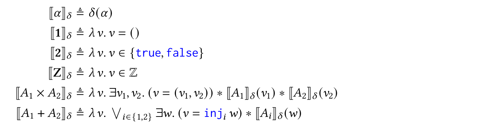

The value relation for __function types__ is a little more intereting, as it contains Iris specificities: 

$[[A \rightarrow B]]_\delta := \lambda fun\_v. \square (\forall arg\_v. [[A]]_\delta(arg\_v)) -* [[B]]^e_\delta (fun\_v\ arg\_v)$

- the idea is again obvious ... a value behaves like function of type $A\rightarrow B$ if, given an argument of type $A$ the application behaves like something of type $B$

- the _magic wand_ $-*$ is used instead of a normal implecation $\Rightarrow$ for the same reason we used $*$ instead of $\wedge$ i.e. in this case just consistency 

- the definition is wrapped in the _persistence modality_ $\square$ .. but we'll only learn later why that is

Just because I like the last sentence: _" Types are interpreted semantically using
the logical connective to which they are associated via the Curry-Howard correspondence: product
types by conjunction, sum types by disjunction, and function types by implication. This pattern
explains what is “logical” about a logical relation."_

__Existential types__ and __universally quantified types__ also have a little quirk in their definition

One might expect, that they are defined via type application and packing like
$[[\forall \alpha. A ]]_\delta := \lambda v. (\forall B:Type). [[A[B/\alpha]]]^e_\delta (v\langle\rangle)$
and
$[[\exists \alpha. A ]]_\delta := \lambda v. (\exists B:Type). \exists w.( v = pack \langle w\rangle) * [[A[B/\alpha]]]\delta (w)$

... 

The problem is, that the logical relation is based on structural recursion on the type and $A[B/\alpha]$ is not 
structurally smaller than $\forall \alpha. A$

Instead the relations for those types are defined as 
$[[\forall \alpha. A ]]_\delta := \lambda v. \square(\forall (\Psi:Val\rightarrow iProp_\square). [[A]]^e_{\delta, \alpha\mapsto\Psi } (v\langle\rangle))$
and
$[[\exists \alpha. A ]]_\delta := \lambda v. \exists  (\Psi:Val\rightarrow iProp_\square). \exists w.( v = pack \langle w\rangle) * [[A]]^e_{\delta, \alpha\mapsto\Psi } (w)$

... instead of an "actual type", the relations quantify over a semantic type ... that's where we need the semantic environment mentioned before and use it such that the type parameter directly 
maps to a predicate on values instead of a type we again need a relation for
(this only works under the assumption, that client/runtime code cannot syntactically analyze which type implements $\alpha$)

__Recursive Types__
- they have the same problem of non-decreasing typ sizes when definging the logical relation, in fact the type would even increase in the naive definition
- the trick here is to use the _later modality_ (▷) 
- the relation otherwise looks like the expected naive one but the property of the value being semantically typed will only be accessible after one tep of computation. For reason that are postponed to later parts of the papaer this suffices to solve the well-soundedness of the definition:

$[[\mu\alpha.A]]_\delta(v) = (\exists w. (v=fold\ w) * \triangleright [[A[\mu\alpha.A/\alpha]]\ ]_\delta(w) )$

__Reference Types__

- something that _"behaves like a reference to a value of type A"_ should have two properties 
a) it should represent a location in memory that stores something of type A
b) that something might change in it's value but never in it's type

- to formalize this the rule uses a) the _points-to connective_ $\mapsto$ and b) _invariant assertion_ $\boxed{P}^N$ as
$[[ref\ A]]_\delta := \lambda v. \exists (l:Loc). (v = l) * \boxed{\exists w.l \mapsto w * [[A]]_\delta(w)}^{N_l}$ 

spelled out: Something is a valid refernce of type A if it is a location in memory and the value w it points to is always of type A. $N_l$ is a specific invariant namespace for that location l.

### The Semantic Typing Judgement

The relations above are defined for closed expressions.
To also account for expressions containg free variables another mapping called 
_closing substitution_ $\gamma$ is introduced. It associates variables to (closed) values. 

Obviously that mapping also has to satisfy the semantic typing rules so we "check it" against the variable context $\Gamma$ that stores the type of variables i.e. a substitution $\gamma$ is a valid _context interpretation_ $[[\Gamma]]_\delta^c$ of a variable context $\Gamma$ if it maps all variables from $\Gamma$ to values, that are valid for the type those values have in $\Gamma$: 

$$\Gamma \models e: A := \square (\forall \delta, \gamma. [[\Gamma]]_\delta^c(\gamma) -* [[A]]_\delta^e(\gamma(e)))$$

.. so in an environment $\Gamma$ e has type A, iff for any valid mapping from type variables to values $\delta$ and any valid mapping from term variables to values $\gamma$ e behaves like something of type A.

## Logical Type Soundness: Proving Semantic Type Soundness in Iris

- goal: prove semantic type soundness within the separation logic framework of Iris

e.g. prove: $\frac{\Gamma\models e_1: A\rightarrow B \ \ \ \ \Gamma\models e_2:A} {\Gamma\models e_1\ e_2: B}$

first step: the typing judgement $\models$ is defined in Iris so we turn the rule into an implication 
$\Gamma\models e_1: A\rightarrow B \ * \ \Gamma\models e_2:A \ \ -* \ \ \  \Gamma\models e_1\ e_2: B$

### Language Parameterization and Basics of Iris 

__Subtitle: How to instantiate Iris for a concrete Language__

Iris is parametric in the types of:
- expressions
- values
- states and
- reduction relations
to reason about.

Rules for Iris connectives (separating conjunction and implication, points-to) and modalities (later, persistent, update, fancy update) are independent of the instantiation

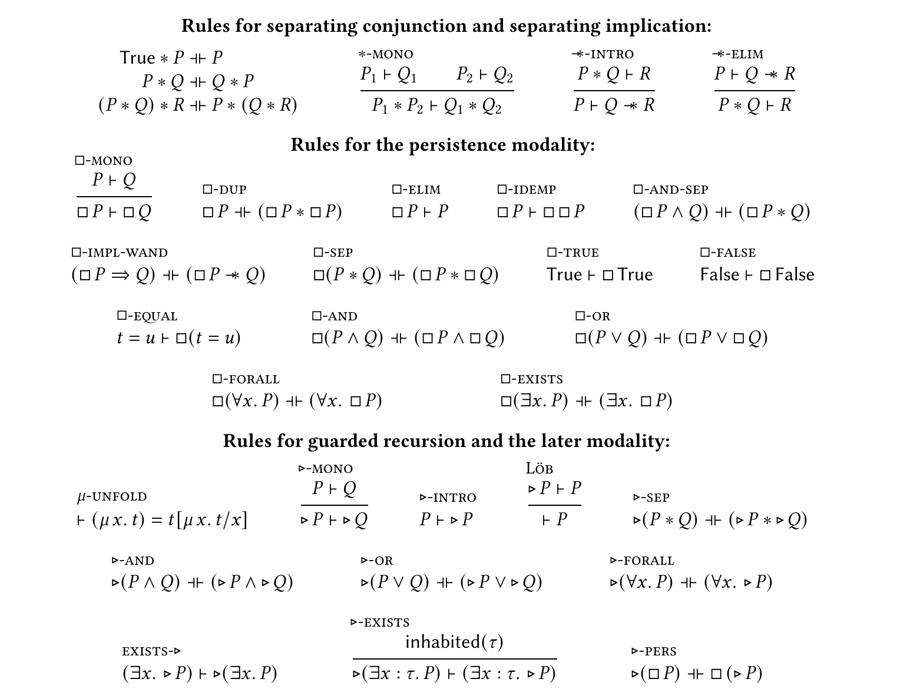

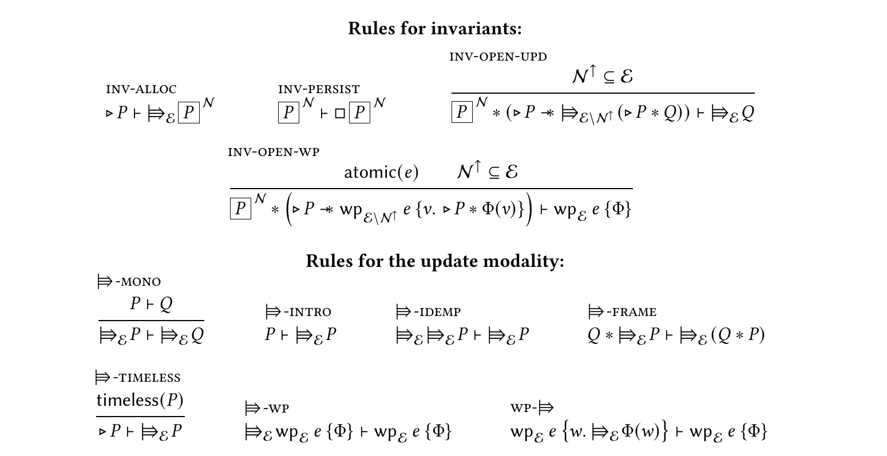

Rules for weakest-precondition i.e. how to reduce (reason about) 
wp tripples are tailored to the expression of the language intantiation (in this case tailored to the expressions of MyLang and their reduction rules)
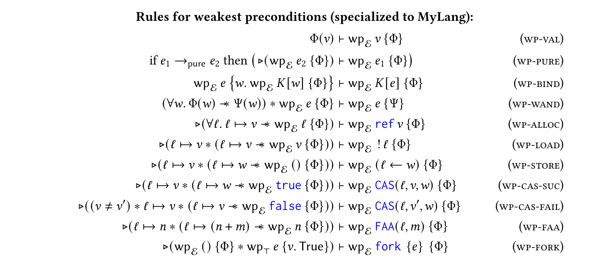

_" To use Iris, it is not necessary to understand the Iris model. Rather, the key purpose of the model is to establish the adequacy theorem of weakest preconditions, which says that 
__a closed proof of a weakest precondition implies safety__ w.r.t. the operational semantics"_

__Adequacy Theorem:__ If $True\vdash wp\ e\ \{ \Phi\}$, then $safe(e)$

### Persitent vs. Ephemeral Propositions - and the $\square$ Modality

- in separation logic, propositions _may_ express exclusive ownership (e.g. if there's some points-to connective in the preconditions, it asserts the guarded expression exclusive ownership of the memory location)
- exclusive ownership gives the right to mutate => mutation invalidates assumptions => propositions about exclusive ownership are _ephemeral_ (e.g. $l\mapsto3$ might not hold throughout our program)
- _persistent_ propositions are expected to hold "forever", such as the type of the value a reference is pointing to (previous example) or user defined assertions about state that should uphold in any program state (like a thread count being non-negative) using _invariant assertions_

- _persistent_ propositions $P$ do not offer exclusive capabilities (ownership, write access ...), therefore they can be shared as 
  $P \dashv\vdash P * P$
.. this means we can have two "disjoint" copies of $P$ and using Iris' Frame Rule we can split them to reason about subexpressions (like threads)

- as seen before, _persistence_ is expressed using the _persistence modality_ $\square$

- the rules for this modality are shown above, also 
$iProp_\square := \{P | persistent(P)\}$
$persistent(P) := P \vdash \square P$
and 
$P\vdash Q\ *\ persitent(P) -*\ \ P\vdash\square Q $

Throwback to Typing judgements: 

When showing that $\Gamma \vdash e:B$, $\Gamma$ contains the free variables in $e$ such as $\{...,x:A, ...\} \vdash e:B$. 
To show that $e:B$ we need the assertion $x:A$ for every occurence of $x$ in $e$. So typing of $x$ must be persistent and shareable. Therefore all value interpretations return an $iProp_\square$
(This is also very intuitive I think since, if a particular value is a valid interpetation of a particular type should not change during execution/reduction)

This is in fact the case for all concrete type value interpretations we've established in section "Interpretations of concrete types" for MyLang and must be adhered to for other type/value instantiations.

### Weakest Precondition

The Iris connective _weakest precondition_ $wp\ e\ \{\Phi\}$ represents that given a post condition $ \Phi: \ Val \rightarrow\ Prop$ we get/search the weakest precondition such that $e$ is _safe to execute_ and _satisfies_ $\Phi$

__Pure Expressions__

- if e is a value, we can proof $wp\ e\ \{\Phi\}$ by proving $\Phi(v)$
- if e is can be reduced to $e_2$ by a pure step we can reduce the proof to 
  $\triangleright (wp\ e_2\  \{\Phi\})$ meaning we proof the weakest precondition for $e_2$ one computation step later

=> After all the goal of al reductions we apply is to reduce the expression and with it the preconditions until we reach something (a value) for which we only have to prove the post condition. 

Example : `if true then () else 42(23)` is obviously ill typed in the else branch. 
However with semantic typing we can assert it's well typed and saef to execute because only prove the branch that will get executed. 

__Composition of Proofs of wp__

There's tow important rules to combine wp-proofs

1. __WP-Bind__: Proving the weakest precondition for $K[e]$ can be done by proving the 
   weakest precondition for e itself (we'll get the result value $w$ from that) and then proving the weakest precondition for plugging e's result into K. Formally

   $wp\ e\ \{w.\ wp\ K[w] \{\Phi\}\} \ \vdash\ wp\ K[e] \{\Phi\} $ 

2. __WP-Wand__: This rule say's that wp proves are monotonic i.e. if we prove that a value fulfilling some condition $\Phi$ implies that it also fulfils some condition $\Psi$ and we know that $wp\ e\ \{\Phi\}$ we can replace $\Phi$ by $\Psi$. This is required when we combine proofs of subexpressions that e.g. acted on disjoint parts of where $\Phi$ by $\Psi$ state something about those memory regions. Formally:
 
    $(\forall w. \Phi(w)\ -*\ \ \Psi(w))\ *\ wp\ e\ \{\Phi\} \ \vdash\  wp\ e\ \{\Psi\}$

  and derived from monotonicity the __WP-Frame__ rule: 

  $P\  *\ wp\ e\ \{\Phi\} \ \vdash\  wp\ e\ \{w.\ P * \Phi(w)\}$

Example: We allready proved that $wp\ e\ \{v. v = () \}$ in the example above and now put $e$ into an application context i.e. $(\lambda x. x) e$ using the rules (backwards) we get the following proof tree 
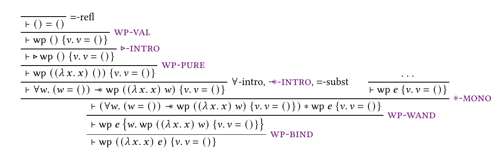

__Hoare style specification and stateful expressions__

For state involving/manipulating expressions (reference, load, store), the separation logic Hoare Tripples can be writte as: 

$\{True\}\ ref\ v\ \{l. l\in Loc\ * \ l\mapsto v\}$
$\{l\mapsto v\}\ ! l\ \{u. u=v * \ l\mapsto v\ \} $
$\{l\mapsto v\}\ l \leftarrow w\ \{u. u=() * \ l\mapsto w\ \} $

Those rules are valid in Iris but _"inconvenient"_ in proof trees and Coq proofs

Hence instead of 

"precondition" "expression" "postcondition"

Iris rules have the following form: 

"precondition" * ("postcondition"  -* wp "result" {$\Phi$}) $\vdash$ wp "expression" {$\Phi$}
(Reads: if the precondition is satisfied and the postcondition implies, that the result under some weakest precondition satisfies some postcondition $Phi$, than 
        executing e under these weakest precondition also satisfies $Phi$)

So Iris ref and load  rules (for MyLang) look as follows

$\triangleright(\forall l. l\mapsto v\ -*\ wp\ l\ \{\Phi\})\ \vdash\ wp\ e\ \{\Phi\}$ 

$\triangleright(l\mapsto v\ * (l\mapsto v\ -*\ wp\ v\ \{\Phi\}))\ \vdash\ wp\ !l\ \{\Phi\}$ 

$\triangleright(l\mapsto v\ * (l\mapsto w\ -*\ wp\ ()\ \{\Phi\}))\ \vdash\ wp\ (l\leftarrow\ w)\ \{\Phi\}$ 

SideNote: Löb recursion
Löbs theorem says, if you can proof for a formular P that _"If P is provable then it is true"_, then P must be provable in the first place. 
(modulo some constraints on the formal system you're reasoning in).

$\vdash (provable(P) \rightarrow P) \rightarrow provable(P)$ 

and this is obviously a bit circular so we can reduce it to  

$\vdash (provable(P) \rightarrow P)$

In Iris this is used for the following rule/argument => P is true if we can prove P at some time later ($\triangleright P$). 
So the rule for Löb induction say's

$$\frac{\triangleright P\vdash P}{\vdash P}$$

As an example the paper gives a proof tree for a recursive program `loop := rec f(x) = 1 + f(x)`
with the specification $wp\ loop\ \{False\}$
  

__Monadic Rules for Expression Interpretation__

The "prove flow" for proving semantic typing judgemtns is in general 
1) unfold the expression interpretation
2) unfold the value interpretations
3) repeat when value -> expression again
4) obtain the Iris proposition and prove it using the rules we saw before

Now the problem might be, that we don't know e, we just know it's well typed.
So instead of reducing it in the proof to get to a value and prceed with the context, 
we can just conclude, from e being well-typed, that there is a v that e evaluates to with the acording type. 
To use this in a proof, it's formalized as monotonicity rules (LOGREL-VAL and LOGREL-BIND) as follows:

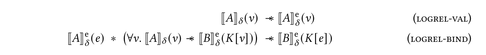

### Proving Typing Rules

__Variables and Ground Types__

The rule for variables is simply, that they have a semantic type A if the variable context says so. 

$$S-VAR: \ \ \ \frac{x:A\in\Gamma}{\Gamma \models x:A}$$

How can we prove that?:

1. We unfold the definition of $\models$ as defined [here](#the-semantic-typing-judgement)
   so we have to show 
   $ \square (\forall \delta, \gamma. [[\Gamma]]_\delta^c(\gamma) -* [[A]]_\delta^e(\gamma(x))) $
2. We assume $x:A\in\Gamma$ so any valid interpertation of that context i.e. each valid _closing substitution_ $\gamma$
   must entail that the interpretation of $x$ under $\gamma$ is in the type relation of $A$ i.e. 
   $[[A]]_\delta(\gamma(x))$
3. As $\gamma(x)$ i a value, we can apply the LOGREL-VAL
 rule and get the semantic typing judgement for the expression.

The rule for ground types is also simple.
If they are a member of the set of instances of their type
they semantically are of that type.

$$S-UNIT: \Gamma \models ():\mathbf{1}\ \  S-INT \frac{n\in \mathbb{Z}}{\Gamma\models n:\mathbb{Z}}\ \ S-BOOL \frac{b \in \{true, false\}}{\Gamma \models b:\mathbf{2}}$$

Likewise the proofs are straight forward. 
1. We have to show again that each valid closing substitution $\gamma$ and any value substitution $\delta$ the members of a base type are in the value relation of their type. 
2. Members of base types are closed values, so any $\gamma$ will just map them to themselves
3. being a member of the base type is just the definition of the base type value relation $[[BaseType]]\delta := \lambda v . v \in {BaseTypevalues}$
4. and finally we can apply  LOGREL-VAL again. to geht the typing judgement for the corresponding expressions.  

Any other expressions (abstraction, application, if-then-else) etc. are proven by 
1. proving typing for a closed version of the expressions and
2. proving that the type judgement still holds when a closing substitution is involved (we can assume one for closed 
  terms as well, it woud jsut not have to map anything)

So for example for if-then-else expressions the first/auxilliary proof shows

$[[2]]_\delta^e(e_{if}) \ * \ [[B]]_\delta^e(e_{true}) \ * \ [[B]]_\delta^e(e_{false}) \ -* 
 [[B]]_\delta^e(\textcolor{blue}{if}\ e_{if}\ \textcolor{blue}{then}\ e_{true}\ \textcolor{blue}{else}\ e_{false}\  ) $ 

(reminder __2__ represents the type Bool)

That's the proof tree for this implication:

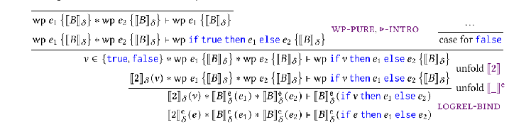

The second step i.e. the actual proof of correct semantic typing is to show that assumed semantic typing of $e_{if}$,$e_{true}$ and $e_{false}$ implies t

$ \square (\forall \delta, \gamma. [[\Gamma]]_\delta^c(\gamma) -* [[B]]_\delta^e(\textcolor{blue}{if}\ \gamma(e_{if})\ \textcolor{blue}{then}\ \gamma(e_{true})\ \textcolor{blue}{else}\ \gamma(e_{false})\  ))$

From the assumptions we know that the three subexpression are semanticaly well typed so we get:

$[[\Gamma]]_\delta^c(\gamma) -* [[2]]_\delta^e(\gamma(e_{if}))$ and $[[\Gamma]]_\delta^c(\gamma) -* [[B]]_\delta^e(\gamma(e_{true}))$ and $[[\Gamma]]_\delta^c(\gamma) -* [[B]]_\delta^e(\gamma(e_{false}))$

Since in each of those implications the interpretation of typing contexts is persistent (remember the persistence modulator), we can duplicate it i.e. take it out of the equation and can just use the auxilliary proof to finish the goal. 

__Product, Sum and Function Types__

The proofs for Product and Sum types are not explicitely given, but in principle they show that semantic typing follows the same structural rules (S-APP and S-REC) as syntactic typing for those types using the same approach as described before. 

There's two forms of function application, that are explicitely considered in the section, namely normal application (rule S-APP) and application of recursive functions (rule S-REC). 
The goal is still to show that the same typing rules apply for semantic and syntactic typing. 

The proof again follows the same steps as before, proving the auxilliary form for closed terms and extending the
proof via persistence. The according proof steps (i.e. derivation trees are given in section 6.6.)

__Universal and Existential Types__ 

Universal and existential types have type parameters. Recall that, to capture their semantic typing, without running into potentially endless type-relacement-loops, we introduced the _semantic environment_ $\delta$, mapping type variables directly to values.  

So as seen below the semantic typing rules for quantified types where "type A in an environment where the quantified parameter has a valid mapping"

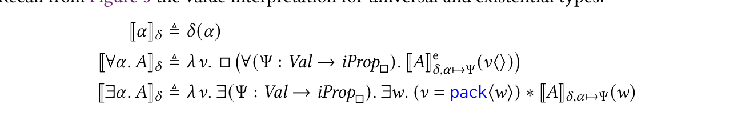

The typing rules we want to prove are: 

Hence the first part of proving the typing rules is showing that the ususal substituion of type paramaters by concrete types is equivalent to the notion of adding a mapping from the type variabel to a concrete type interpretation to the  _semantic environment_ $\delta$, i.e. $[[A[B/\alpha]]]_\delta = [[A]]_{\delta, \alpha\mapsto[[B]]_\delta}$. The proof is not part of skript and only described as 'by mutual induction'

This result can be used to rewrite the prove for the type application rule . The rest of the proof follows the same principle as before (prove for closed expressions, extend by threading the "all valid context interpretations" part through again $[[\Gamma]]^c_\delta(\gamma)$).  

__Recursive Types__
 ToDo

__Reference Types__

Valid value interpretations of a reference type $\mathbf{ref}A$ where defined as locations, pointing to some value that might change but is guaranteed to be of type $A$.
The last part is expressed by an invariant in the relation: 
$[[ref\ A]]_{\delta} := \lambda v. \exists(l:Loc). (v=l)* \boxed{\exists w.l \mapsto w *[[A]]_{delta}(w)}^{N_l}$

Handling invariants comes requires some concepts, other types don't because they are logical concept on top of the actual types in the laguage we reason about.  We've allready seen the rules for allocating (INV-ALLOC), copying (INV-PERSIST followed by $\square$-DUP) and opening (INV-OPEN, INV-OPEN-WP) invariants when we introduced [Iris basics](#language-parameterization-and-basics-of-iris).

__Invariant Allocation__ means, the ownership of a property e.g. a variable in memory is given up to create an invariant i.e. a piece of share(able/d) state. This can be done at any point in a program.

__Invariant Duplication__ as we can see from the rules, invariants are required to be persistent and hence can be copied and shared among states

__Invariant Access__ to access the properties (e.g. memory locations) in the invariant it needs to be opened. This can only be done for atomic steps, and it is only valid if before closing it again the conditions the invariant places on the properties are fulfiled again. Like a logical Mutex, but controlling previously defined conditions on giving it back.

__Invariant Namespaces $\mathcal{N}$ and Masks $\mathcal{E}$__ are used to encure that invariants cannot be opened twice. Each invariant is annotated wih a namespace ($N_l$ in the value relation above.). When we reason about open invariants, the weakest precondition is annotated with an invariant mask ($wp_\mathcal{E}$ in the INV-OPEN-WP rule below. This mask tracks available invariants. So in the begining this set contains all invariants and by opening an invaraint, it's Namespace is removed from the mask. It's a namespace, and not just a name, because invariants (and the namespaces tracking them) can be nested and we don't want reopening of nested invariants. So  $\mathcal{N}^\uparrow$ is the set of all invariants with $\mathcal{N}$ as a prefix.

The INV-OPEN-WP rule below can roughly be read as follows:

1. $e$ is an atomic expression
2. the set of invariants in the namespace $  \mathcal{N}^\uparrow$ is in the mask of available/openable invariants $\mathcal{E}$
*---------------------------------------------------*
1. owning (a copy of) the invariant $P$ and 
2. opening it, such that the execution of e yields v and fulfils some post condition $\Phi$ 
implies that 

under the same weakest precondition with $\mathcal{E}$
executing $e$ satisfies $\Phi$

The later modalities in the rule $\triangleright$ are "technically requried" to allow _impredicativity_ i.e. allowing any Iris proposition to become an invariant. 

The rule for allocating invariants is now way easeir to read
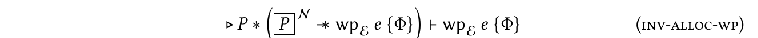

Basically if owning P and turning it into an invariant makes the execution of $e$ under $wp_{\mathcal{E}}$ satisfy $\Phi$ implies that $wp_{\mathcal{E}}\ e \{\Phi\}$ ... notice that after allocating the invariant $\boxed{P}^\mathcal{N}$ is part of $\mathcal{E}$.

Having those rules up the sleeve, the paper proceeds to expplain the proofs for typing rules of reference allocation (S-ALLOC), loading (S-LOAD) and storing (S-STORE) values. 
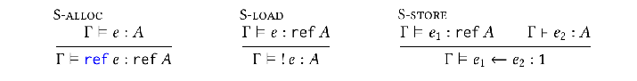

The proofs proceed in the same steps as before, the proof trees and aome notes on the rules applied are described in the paper.

#### The Fundamental Theorem and Adequacy

The __Fundamental Theorem__ claims that syntactic typing implies semantic typing. i.e.

_Every syntactically well typed term is semantically well typed or if $\Gamma\vdash e:A$ then $\Gamma\models e:A$_

By proving that for each expression, the semantic typing rules have exactly the same structure as their syntactic counterpart we allready established this theorem in the last paragraphs (modulo an inductive proof over expressions). 

The __Adequacy Theorem__ states that semantically well-typedness implies safety of an expression. The proof basically argues that
1. semantically well-typeded means being in the value relation of the respective type.
2. and this means evaluating to a value of that type of that type under some weakest precondition.
3. finally we allready established that 
"evaluating to a value of that type of that type under some weakest precondition." is adequat to imply safety.

From the __Fundamental Theorem__  and the __Adequacy Theorem__ we get

__Semantic Type Soundness__ i.e. 
_Every closed syntactically well-typed expression $e$ is safe. Formally, if $\empty\vdash e:A$, then $safe(e)$._

## Safe Encapsulation of Unsafe Features

- in the last section we used the _logical approach_ to establish the _well-typed => safe_ type soundness theorem for semantic typing

- if you thought, _well ... that's a lot of effort to get just the same result as with good old syntactic typing_ you're right

- the point where semantic typing becomes interesting is ... right now, because now we start to establish semantic well-typedness where syntactic typing wass just to weak and extend the expressiveness of typing and it's implications for safety

- we get back to the `gremlin` expression, an expression that would randomly update a memory location to `0`, keeping syntactic typing uneffected but destroying safe encapsulation.

- now, with the new Iris-based semantic typing, `gremlin` can only be properly typed, if it owns the location it updates. by that requriement, we can exclude gremlin and the actual owner of the randomly chosen memory location can interfere i.e. there is no more "well-typed but unsafe" gremlin

- furthermore, remember the abstract data type `symbol` we had as example for the limitations of syntactic typing for safe encapsulation

  $$concrete\_symbol:= let\ c\ = ref\ 0\ in \\
               pack\langle Z, (\lambda().\ FAA(c, 1), \lambda s.\ assert(s <\ !c)) \rangle  
             $$
  This implementation is safe, although `assert false` is undefined iff we can guarantee that no-other access than the atomic FAA accesses the counter `c`, because then we can guarantee that any existing symbol mis in fact smaller than the current counter.

-  as the paper explains, we want to establish, that at any point in time anything of type `symbol` is smaller than the current counter in other words, symbol is well-typed and therefore safe
 $$\models symbol:symbol\_type$$

- so we need a typing relation for $symbol\_type$ or, in semantic-typing parlance, we need to define what it means for a value $v$ to behave like a valid instance of $symbol\_type$

- first try : $\lambda v. \exists (n:\mathbb{N})(v<n)\ * \ c\mapsto n$
- the problem is, that this function is not persisten, because it requires ownership of the location c, but predicates for typing relations need to be persistent ($\Psi: Val \rightarrow iProp_{\square}$)

=> introducing __ghost states__

### User-defined Ghost States

- the concept isn't Iris-exclusive
- it's named ghost variables, permissions , protocols or history/prophecy assertions in other context and generally used as an auxillary state to track ownership (i.e. something that's only part of the proof, not a physical part/memory location of program we reason about)

- Iris' Ghost States are _user-defined_ because one can establish a kind of ghost state for any ressource that shall be tracked in a proof

- to establish a new kind of ghost state, one needs to define a _resource algebra_ describing how to compose and share the new ghost state and how to determine wether a state is valid. however that's not described in the example at hand.

- for the ghost state representing the counter i.e. _ghost counters_, the following rules are defined: 
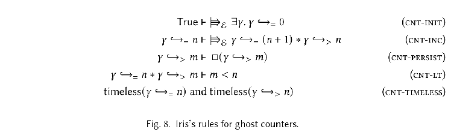

- the $\hookrightarrow$ symbols are connectives, just like points-to $c \mapsto v$ for pyhsical memory locations
- $\hookrightarrow_=$ is ephemeral, it asserts that at this point in time the ghost state points to some value $n$
- $\hookrightarrow_>$ is persistent, it asserts that at any point in time the ghost state points to some value larger than $m$

- the rules assert that 
  - one can allways greate a new ghost counter that points to 0 (CNT-INIT), 
  - one can inrease the ghost counter and yield two new predicates about the counter state (CNT-INC),
  - the $\hookrightarrow_>$ predicate is persisten i.e. can be shared (CNT-PERSIST)
  - iff we have ownership of both predicates for one ghost counter we can conclude $ m < n$ (CNT-LT) and
  - ???

- using ghost counters two predicates are established for valid symbols:
  $$I_{\gamma} := \lambda l. \boxed{\exists n:\mathbb{N}. l\mapsto n * \gamma \hookrightarrow_= n}^{N_{symbol}} \\
  \Psi_\gamma := \lambda v. v \in \mathbb{N}\ *\ \gamma \hookrightarrow_> v $$

Before we go on the __Update Modality $\Rrightarrow$__ needs some explanation.
The problem with ghost states is, that we still need to connect them to the reasoning about physical program states again. Very basically the update modality asserts something holds after _frame preserving updates_ i.e. a potential update in the physical memory (in this case also restricted by the current invarian mask $\mathcal{E}$) that does not interfere with any other part in memory. 

The paper proceeds to explain, the rules allowing to integrate ghost states into pre and post-conditions of "normal" weakest-precondition reasoning using the update-modality

For example we can establish the following, transformed rule for increasing ghost counters to use it together with expression that might use or modify the actual counter:

Explanation from POPL tutorial (rephrased) and "Iris from the ground up"
  - ghost variables are not a part of the actual program i.e. they are not changed, just because the program does something to the underlying physical resource 
  - how can they be update ... using the update rule and _frame preserving updates_
  - _frame preserving_ means, one can make an update to a fraction of a ghost variable iff this update does not interfere with the assumptions ony other thread possessing a fraction of the ghost variable makes
  - more formally:
  Supposed there is a resource `a` that can be split into multiple fragments `a1,a2, ...`
  The resource algebra for any kind of ressource includes a way to recompose those parts to a valid resource again
  Now a frame preserving update `a1`$\rightsquigarrow$ `b` preserves that composition i.e. if you could compose `a1` and `a2` to a valid resource, this must also be possible for `b` and `a2`
- Now the update modality allows to reason about those ghost variable updates i.e. 
  $\Rrightarrow P$ holds for a ressource `a1` iff we can update it to some `b` (`a1`$\rightsquigarrow$ `b`) 
  that would still satisfy $P$

ToDo: I got lost along the argumentation on update modalities. Can we discuss that (p 47 - 49) if needed?

Back to proving that 
  a) `symbol` is semantically well-typed i.e. $\models symbol : symbol\_type$ and
  b) `gremlin` is semantically ill-typed

... and hence to showing that semantic typing let's us reason about safe encapsulation.

a) $\models$ was defined as being in the value relation of the type in question so we have to show
  $[[symbol\_type]]_\delta^e(symbol)$

The proof tree largely consists of unfolding definitions of the symbol type and of "being a member of expression/value rlations of a type". 

## Representation Independence
## Additional Related Work

## Conclusion

discusses briefly 
1. that "the logical approach" (semantic typing + separation logic) is scalable (remember that was a limitation in previouse step indexed approaches)
2. how to extend it/the use of Iris to different languages/type systems/program properties
3. how the approach has allready been used in research 

and give some links to get started (which you can also find in [this repo](./approaching_coq_and_iris_tourguide.md))

### 2. Extending/Implementing Iris for different Languages/Type Systems/ Properties

To apply "the logical approach" with a new language (like it has been done for HeapLang, MyLang ... ) these are the principle steps: 

1. Instantiate Iris with the language:
  - mostly by defining syntax and semantic 
  - instead of defining them from scratch, existing languages (HeapLang) 
    can be modified (e.g. done [here](https://gitlab.mpi-sws.org/iris/actris) to include session types in HeapLang)

2. Define the reasoning principles for the language
 - basically one has to define what the logical connectives for ownership (e.g. points-to) and 
   for program reasoning (e.g. wp) mean in this language
 - if the language can be described with the common small-step operational semantics in Iris, 
   also the generic versions of the connectives can be used
 - You want to implemement your own reasoning priciples e.g. to
    - to reason about different memory models (e..g block/offset based, RustBelt did this) or different  (physical) ressouces like program counters or any low level machine specific capabilities  
    - describe operational semantics differently e.g. big-step
    - establish different properties e.g. security  
    - describe non-local control e.g. effect handlers
  - the paper cites examples of each (probably with code artifacts)
 - to do so, Iris includes a base logic (including separating conjunction, magic wand, modalitites)
   to build a new logic
 - finally there's examples for a _middle ground_ that just modifies existing reasoning
 
 3. Define ghost theories
 
 - the second point just handled the reasoning about the actual program i.e. 
   modifications of physical ressources and exiting program values
 - to describe and trace properties, that are not part of the actual language one needs ghost
   theories
 - there were three examples of _ghost theories_ in the paper a) the usage of invariants b) the _counter_ ghost states to model the symbol type and c) the specification ressources to model representation independence
 - to define a custom ghost state theorie, one has to implement a Ressource Algebra for it (i.e. how to create, combine, share and validate those ressources) as explained in Part 2. of the [Iris Tuturial POPL 2021](https://www.youtube.com/watch?v=LjXaffBpMag)

### 3. Examples of 'the logical approach' in the (scientific) wild

The section of the paper briefly mentions research based on Iris including 
- proving type soundness for (i) a _significant_ Rust subset (ii) an extension of Scalas core type system (iii) session types (iv) refinement types for C
- proving _robust safety_, representation independence, program refinement and _variouse security properties_  

It also very briefly hints to the difference in reasoning about unrestricted type systems (such as MyLang, where value interpretations for any type are persistent) an substructural type systems (such as the ownership system in Rust, where the interpretation of 'non-copyable' types might change during evaluation of a program)

ToDo: Checkout Memory Model in RustBelt